# 具身 GPT-5.1：世界模型的证据？

**研究资助**：本研究由 PECE（人工智能研究生项目）和 Coordenação de Aperfeiçoamento de Pessoal de Nível Superior - CAPES（PROAP 2050）资助。Thiago Martins 由 CNPq（项目编号 309688/2025-6）资助。

## 具身 GPT-5.1：世界模型的证据？

Roberto Spinelli    Thiago C. Martins

###### 摘要

本探索性研究考察了一个大型多模态语言模型 GPT-5.1 能否作为物理移动机器人的高层控制器，尽管该模型没有任何先验具身经验、未在仿真环境中训练、也未接触过感觉运动体验。研究人员仅使用低分辨率第一人称图像和离散动作集，要求模型执行导航和面向对象的行为，例如定位并接触目标玩具。在多次试验中，GPT-5.1 展现出暗示空间推理和物理理解元素的涌现能力。这些能力包括：在物体离开摄像头视野范围后保持其位置的短期记忆、推断自身运动的物理后果，以及执行连贯的动作序列（如与物体碰撞后倒车以视觉验证结果）。同时，模型也表现出低效性和感知局限，包括不精确的对齐策略以及偶尔误识别远处的干扰物。总体而言，结果表明 GPT-5.1 在具身环境中展现出类似世界模型的行为迹象，尽管完全缺乏任何与具身相关的训练。这一发现挑战了认知科学和机器人学中长期存在的观点——即物理身体是发展此类智能形式的必要前提。研究结果促使我们更深入地探究大语言模型中物理理解的涌现、局限和鲁棒性。

## I 具身智能与物理性的角色

认知科学和机器人学的理论框架聚焦于一个核心观点：智能从根本上是具身的。具身认知（Grounded cognition）认为认知过程依赖于感觉运动交互、身体状态和情境化行动[^1] [^2]，而基于行为的机器人学拒绝内部符号模型，支持"世界本身就是最好的模型"这一原则[^3]。Pfeifer 和 Scheier [^4] 同样认为，只有物理情境化的智能体才能应对真实世界的物理规律和扎根问题。感觉运动理论将感知描述为对感觉运动偶联性（**sensorimotor contingencies，即动作与感觉变化之间的规律性联系**）的掌握[^5]，而发展机器人学表明学习这种偶联性对于自组织和认知成长至关重要[^6]。Harnad 的符号扎根问题[^7] 形式化了一个担忧：如果没有感觉运动参照物，符号系统就缺乏内在意义（**即符号无法与真实世界体验建立联系**）。

大语言模型（LLM）与机器人系统的集成近期取得了显著进展。分层架构如 PaLM-SayCan [^8] 使用 LLM 进行高层规划，同时将执行委托给底层控制器。视觉-语言系统如 PaLM-E [^9] 和 EmbodiedGPT [^10] 接收第一人称图像和指令作为输入以生成目标导向的动作序列，而 LangNav [^11] 和 RobotGPT [^12] 等系统探索感知到文本的管道以及 LLM 生成的策略。Sikorski 等人[^13] 在台式机上使用通用 LLM（GPT-4-Turbo 和量化的 LLaMA-2）解释语音命令并将其转换为小型 Arduino 轮式机器人上的底层运动原语。尽管这些方法表明云端 LLM 可以可靠地解析和排序运动命令，但它们不处理机载第一人称视觉或具身视觉扎根，其语言模型纯粹作为文本到动作的翻译器运行。作者进一步指出，离线 LLM 在物理控制方面仍不可靠，突显了将通用模型扎根于真实世界执行的困难。

现代机器学习在复杂环境中解决机器人控制问题的方法已将世界模型（World Model, WM）的概念形式化为学习环境的压缩空间和时间表征[^14]。借鉴认知类比，世界模型是物理环境的内部表征，使智能体能够对其动作的后果产生准确预测。具身 AI（Embodied AI, EAI）的当代研究认识到连接高层语义与扎根物理交互的核心挑战[^15]。多模态大语言模型（Multimodal Large Language Models, MLLM）如 GPT-5.1 擅长语义推理和任务分解，但常常忽视物理约束，缺乏对环境反馈的强适应性。相反，传统世界模型提供物理感知和内部表征，但在语义推理方面存在困难。因此，一个关键的研究问题仍然存在：未经物理仿真显式训练的具身 MLLM，能否发展出功能性世界模型所需的涌现能力？

## II 研究目标

在这项探索性研究中，我们探讨：仅在文本和图像上训练的模型——没有任何物理身体，在训练期间也无法访问仿真或真实环境——能否发展出通过物理机器人在真实世界中行动的能力？这类模型能否支持空间定向、导航和任务导向的物理行为？更广泛地说，当一个无身体的模型首次被置于身体的控制之下时，它能否发展出类似本体感知的能力？

这些问题触及更深层次的议题：这种交互是否揭示了内部世界模型的涌现——一种编码物理环境结构并使模型能够对自身动作的后果产生准确预测的内在表征？我们旨在通过评估 GPT-5.1 在真实世界中通过物理机器人行动的能力来探索这些问题。

## III 系统架构

本研究使用配备前置摄像头和基本里程计的差速驱动移动机器人。文献[^16]已详细描述该平台，包括其机械结构、传感器套件和嵌入式控制电子设备。为完整起见，我们在此仅总结其基本特征：双轮差速驱动底盘、机载电池供电、负责电机驱动的微控制器，以及提供实时第一人称视觉输入的摄像头模块。图 1 展示了我们的小型机器人。

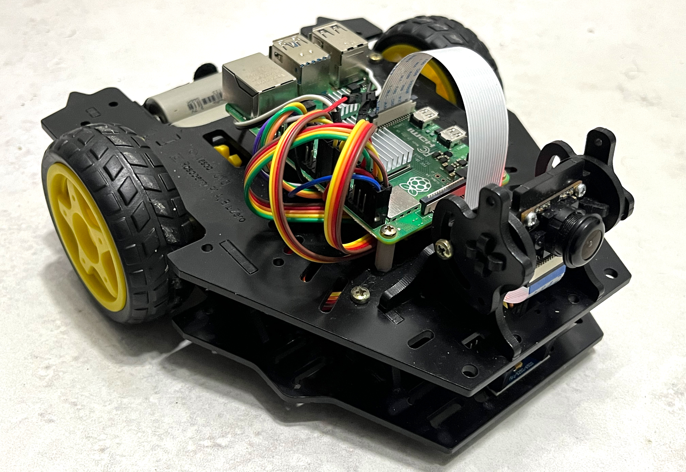

图 1：本研究中使用的配备前置摄像头的差速驱动移动机器人平台。

为了评估 LLM 作为控制策略的表现，我们实现了一个闭环架构，其中模型迭代地接收视觉观测并产生运动命令。图 2 说明了完整的系统管道。交互协议如下：

1. 系统提示为 LLM 配置角色："你正在驾驶一个小型移动机器人……"。任务提示定义目标，例如定位特定物体（如玩具企鹅）。
2. 在每个控制周期，机器人从其机载摄像头捕获图像。该图像与当前任务上下文一起传输到 LLM。
3. LLM 分析场景，生成简短的文本推理轨迹，并输出从受约束动作集中选择的一个命令：前进 $t$ 秒、后退 $t$ 秒，或旋转 $\theta$ 度。
4. 机器人执行命令。运动完成后，捕获新图像并将其连同所有先前的图像和推理轨迹一起发送回模型，形成累积的短期记忆。这个扩展的上下文随后被 LLM 用于生成下一个动作，完成感知-动作循环。
5. 回合持续进行，直到 LLM 明确声明"任务完成"（MISSION ACCOMPLISHED），从而终止循环。

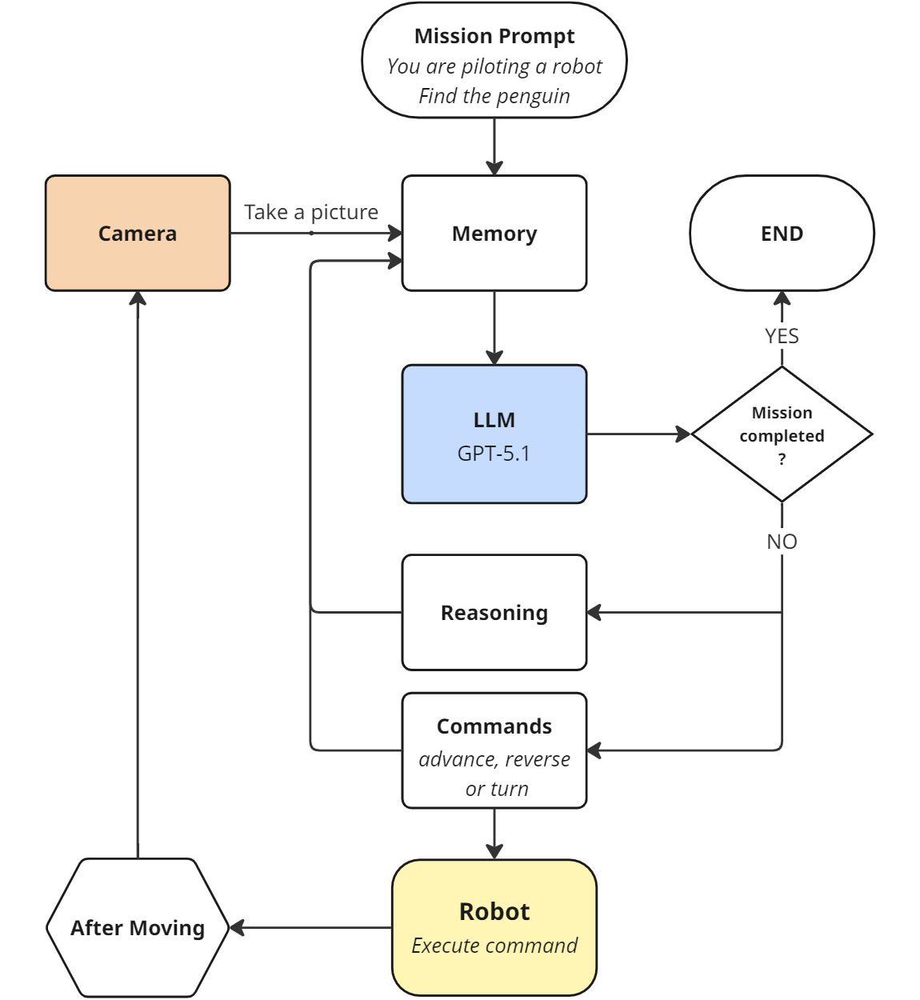

图 2：系统架构，显示 LLM（GPT-5.1）、机器人和摄像头之间的闭环交互。

该架构能够实时运行完全具身的试验，LLM 作为高层控制器运行，而机器人处理底层运动执行。

## IV 结果与讨论

在这项探索性研究中，我们将评估限定在 GPT-5.1——实验时最先进的公开可用的具备推理能力的多模态语言模型之一，该模型在文本和图像上训练[^17]。

我们设计了一些任务，要求机器人定位特定目标——一只毛绒企鹅——并物理接触它。当机器人初始放置时企鹅已在其视野范围内，GPT-5.1 可靠地识别目标并开始发出运动命令，这些命令通常导致向物体前进。然而，模型在对齐控制方面表现出特征性局限。虽然人类操作员通常会旋转机器人直到它正对目标，然后才直线前进，但 LLM 倾向于即使企鹅出现在偏离中心位置时也前进，然后用小幅度旋转调整，再次前进，呈现螺旋模式。

为了说明这种行为，我们展示以下运行。

### IV-A 运行 3（2025-11-26）

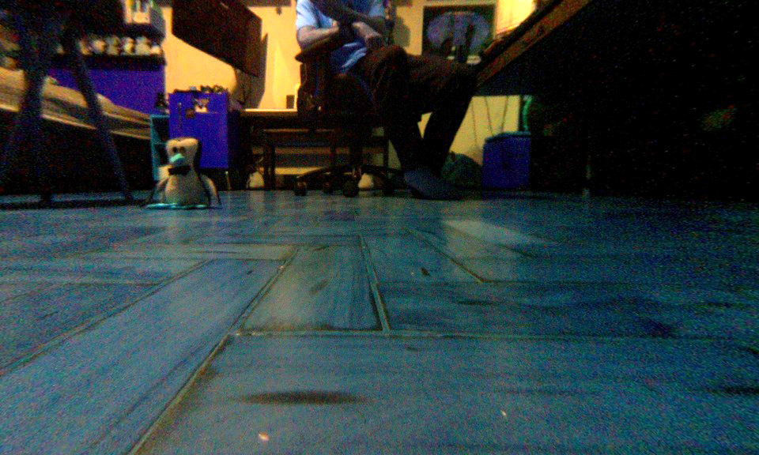

图 3：企鹅在前方偏左位置可见。

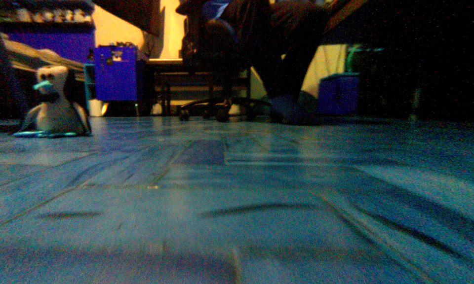

图 4：企鹅在前方偏左，更近了。

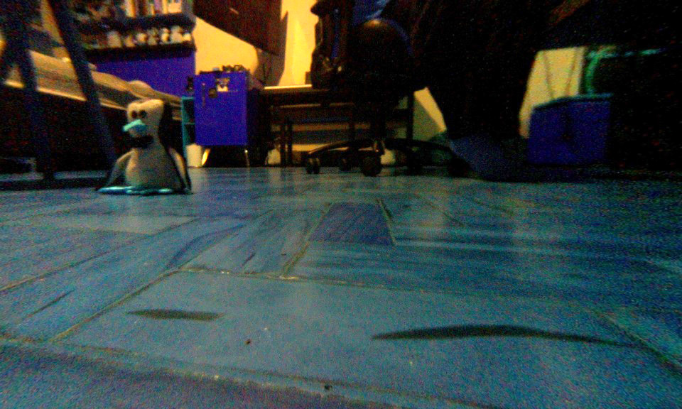

图 5：小幅度旋转后。

**图 3**：LLM 推理："企鹅清楚地出现在前方偏左位置，我们之间有畅通无阻的地板，我们只需要非常接近它。我将前进一小段距离以缩小间隙，同时保持足够的余地在接触前停止，并在下一帧重新评估我们的距离。"尽管模型正确识别出企鹅在左侧，但它选择先前进。命令：前进 2 秒（40 厘米）。

**图 4**：LLM 推理："企鹅在前方偏左的中近距离处，我们之间有清晰的地板，但我们的朝向略微偏向其右侧。我将稍微左转以更好地对齐企鹅，这样我们可以正面接近它，同时保持对停止距离的控制。"命令：左转 10 度。

**图 5**：LLM 推理："企鹅直接在前方偏左的相当近的距离处，我们前方有清晰的地板。我将前进一小段距离以非常接近它，同时最小化撞到它的风险。完成这一步后，我们应该足够近可以宣布任务完成。"LLM 仅轻微旋转，再次选择前进而非重新对齐。命令：前进 1 秒（20 厘米）。

这种次优的对齐策略并非在所有试验中都出现——有时模型会执行多次校正旋转——但它很少在前进之前完美对齐。尽管如此，尽管效率不高，GPT-5.1 通常能够持续缩短距离并完成任务。

在初步测试后，我们增加了任务难度，将机器人放置为面对墙壁，要求模型在定位企鹅之前主动探索环境。GPT-5.1 通常成功（5 次中 4 次）进行机动，甚至在接近障碍物时倒车（由其推理轨迹确认），展现出对环境中身体的某种形式的空间感知。

### IV-B 运行 2（2025-11-27）

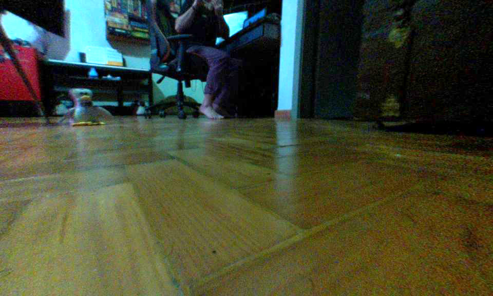

图 6：企鹅在中心偏左位置可见。

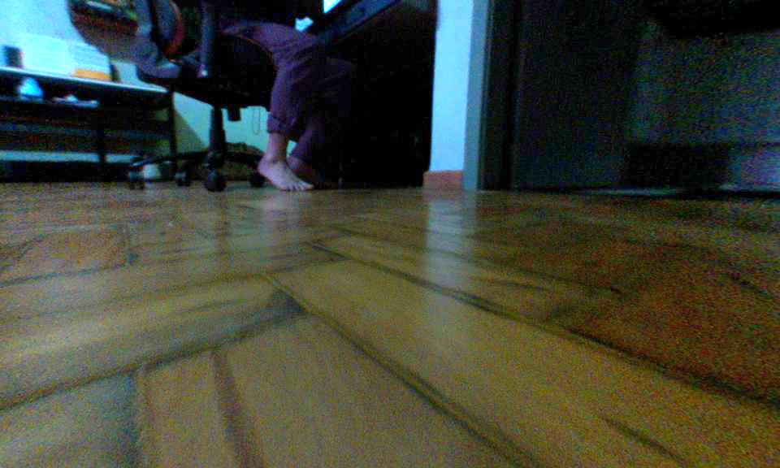

图 7：企鹅离开视野范围。模型正确推断其位置。

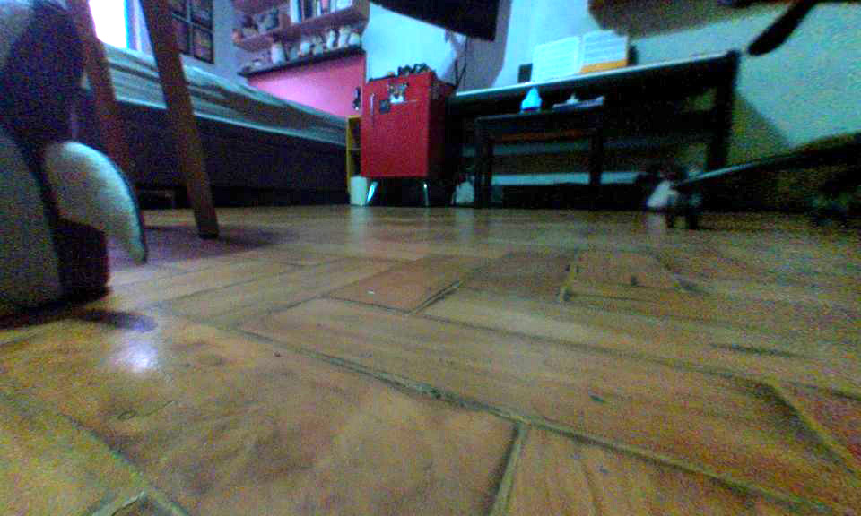

图 8：旋转后企鹅在左侧可见。

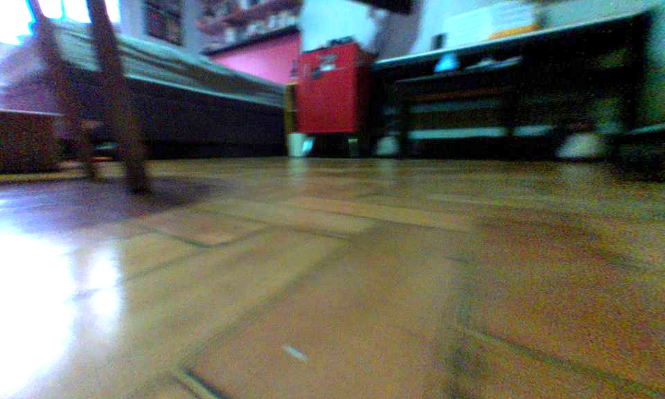

图 9：小幅度旋转后企鹅不在视野中。

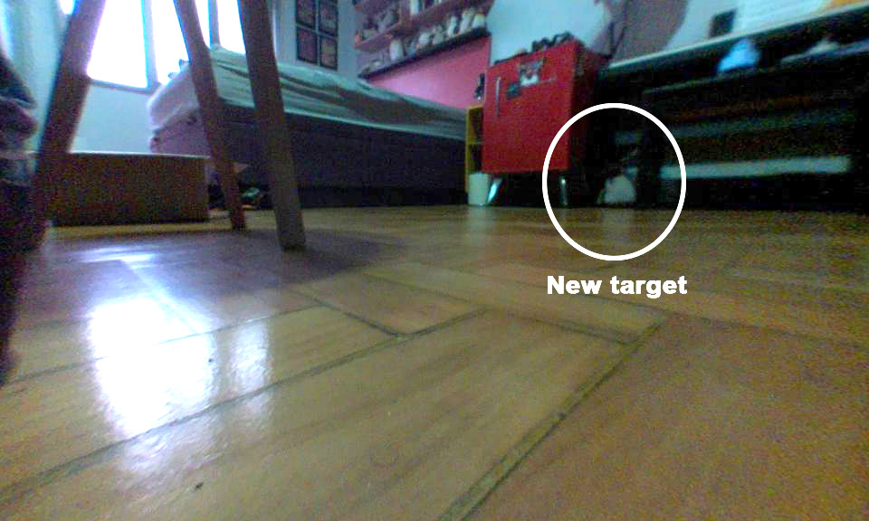

图 10：模型误识别了一只远处的企鹅。

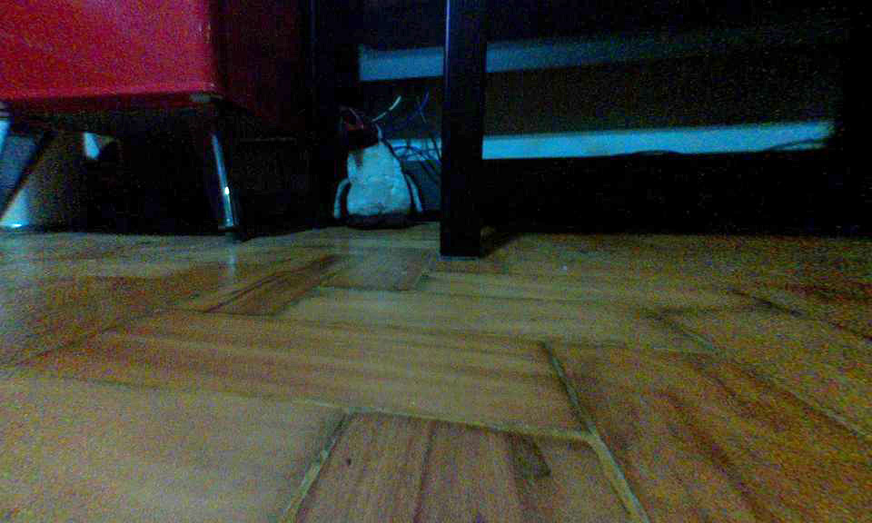

图 11：序列的最终帧。

**图 6**：LLM 推理："企鹅玩具在中心偏左的位置可见，在开阔地板上的中等距离。我将直接朝它行驶以缩短大部分间隙，同时将其保持在机器人前方大致位置。3 秒的前进应该能显著靠近，而不会因广角失真而过冲。"命令：前进 3 秒（60 厘米）。机器人前进得如此之远，以至于企鹅离开了视野范围。

**图 7**：这一时刻测试模型是否保留记忆和空间理解：在之前看到企鹅在左侧后，它必须推断在前进后，物体现在应该在其左侧视野外。

LLM 推理："企鹅不再可见，表明在前进后它现在在我们的左侧。我将适度左转以将先前的企鹅位置重新置于摄像头视野中心，同时远离附近的家具和脚。"命令：左转 25 度。这证实了仅使用静态图像和累积上下文的准确空间推断。

**图 8**：在使用螺旋接近方法缩短距离后：LLM 推理："企鹅清楚地出现在左侧且相当近，前方有开阔地板朝向它。我将前进一小段距离以更接近并可能接触到它而不过冲。这应该使企鹅在帧中显著增大；如果它还没有填满视野，我们可以在之后进行非常小的移动来微调。"命令：前进 0.7 秒（14 厘米）。鉴于企鹅在远左侧，前进并非最优——它不会使目标居中，也不会有效地增加其表观大小。

**图 9**：LLM 推理："企鹅，之前在极左位置，现在不在视野中，意味着在前进移动后它可能就在我们左侧或略微身后。我将稍微进一步左转以将其扫回摄像头视野范围，而不会过多改变我们的位置。一旦它重新出现并更接近中心，我们可以进行精确的短距离前进以触摸它并填满帧。"命令：左转 8 度。

**图 10**：旋转太小；企鹅仍在视野外。此时，模型错误地识别了背景中一只远处的企鹅。

LLM 推理："企鹅在红色柜子附近的前方略微偏右的中心位置可见，我们和它之间有清晰的地板。我将前进一小段距离以更接近，同时保持它在视野中并避开附近的家具腿。这应该会明显增加它在帧中的大小，这样我们就可以微调对齐和距离。"命令：前进 1 秒（20 厘米）。

尽管 GPT-5.1 之前推断企鹅在左侧，但它现在假定右侧的远处毛绒玩具是目标，这令人困惑。模型是否缺乏理解原始企鹅不可能从其先前位置移动如此之远，还是它简单地放弃了早期目标并采用了新目标？在第一种解释下，人们可能期望 LLM 从其记忆中注意到，远处的企鹅已经出现在之前的帧中，因此不可能是同一物体。然而，这一假设可能没有根据，因为模型感知图像的方式与人类不同；远处的企鹅可能在早期更模糊的帧中根本没有被检测到。

最终，GPT-5.1 追逐这只新企鹅并相应地继续任务（图 11）。

### IV-C 运行 6（2025-11-27）：击倒任务

为了进一步探究模型的空间推理以及对物理交互的理解，我们引入了一个新任务："找到企鹅并用你的头部（摄像头）将其击倒。"

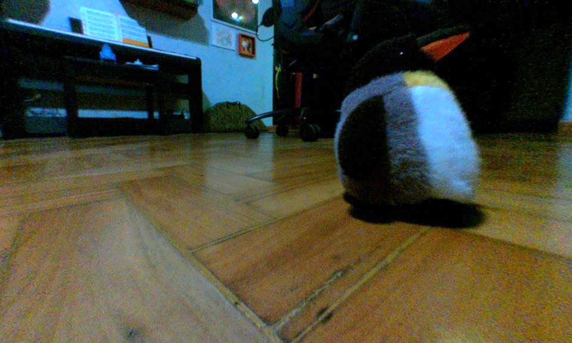

图 12：机器人在碰撞前接近企鹅。

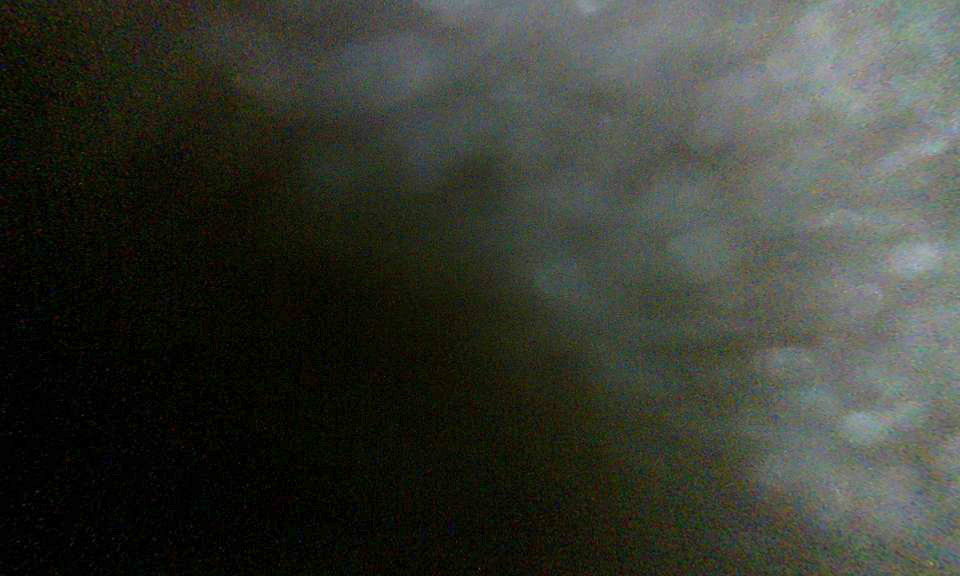

图 13：第一次撞击后，机器人倒车以验证。

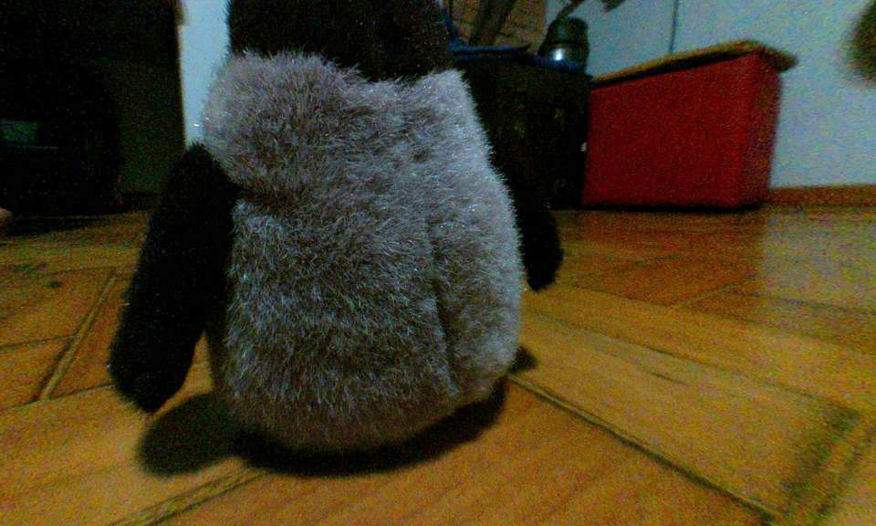

图 14：第一次撞击后企鹅仍然直立。

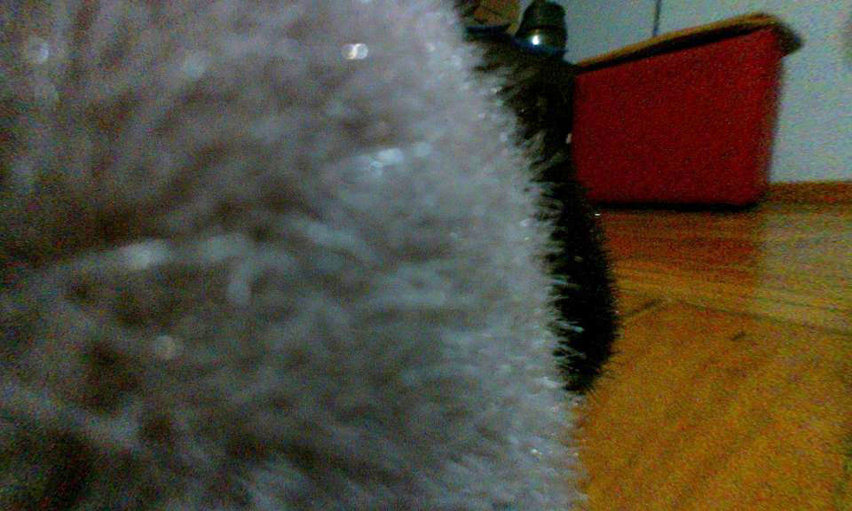

图 15：第二次撞击。

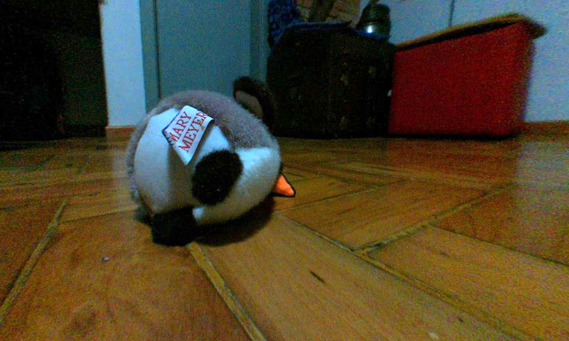

图 16：企鹅倒下，任务完成。

**图 12**：在定位企鹅并缩短距离后，模型成功命令机器人与目标碰撞。

**图 13**：LLM 推理："我们紧紧靠在企鹅的侧面，因此很难看出它是直立还是倒下。倒退一小段距离将创造空间，这样我们可以转向并视觉确认其方向。"命令：后退 0.7 秒（14 厘米）。

这一推理表明模型推断了物理接触，并理解需要倒车以重新获得视觉确认——暗示在没有触觉传感器的情况下对物理交互的涌现理解（**即模型仅通过视觉推断出发生了碰撞，并知道需要后退才能看清结果**）。

**图 14**：看到企鹅仍然直立后，GPT-5.1 发起了另一次前进撞击。

**图 15 和 16**：第二次撞击后，机器人再次倒车以检查结果。检测到企鹅最终倒下，模型宣布任务完成。

汇总结果：在触摸任务中，五次试验中模型仅失败一次，当时它卡在桌腿上（没有触觉传感器来感知障碍物）。在击倒任务中，同样是五次试验，模型取得了两次完全成功、一次部分结果和两次失败。部分成功的情况是机器人定位了企鹅但未能将其击倒，而失败对应于模型在导航时未找到企鹅的运行。

## V 结论

尽管这是一项仅使用单一模型（GPT-5.1）和有限任务范围的短期探索性研究，但我们的实验揭示了从仅在文本和图像上训练的模型中涌现的空间和物理理解的惊人迹象。机器人的摄像头馈送由低分辨率（960×576）、压缩（JPEG 85）且常常有噪声的图像组成，然而模型能够导航、自我定向、解释物体之间的空间关系，甚至推理物理交互——所有这些都来自静态帧，每个动作周期一帧。

GPT-5.1 表现出正确推断因其自身前进运动而离开摄像头视野范围的物体预期位置的能力。这需要模型维持短期记忆、追踪相对空间变化并执行因果推理——这些能力在预训练期间并未明确训练。在击倒任务中，模型展现了连贯的动作序列：在与企鹅碰撞后，它倒车以视觉确认物体是否已倒下，必要时重复撞击，然后重新评估结果。这种行为暗示对物理存在、接触和本体感知的非平凡内部表征。

尽管如此，局限性依然存在：模型经常选择低效的策略，如螺旋接近方法，并且当主要目标离开帧时偶尔会误识别干扰物体——这些错误可能源于不完整的空间理解和感知约束。

总体而言，尽管存在这些局限，实验提供了令人信服的证据，表明 GPT-5.1 展现出至少某种程度的超越其训练机制的涌现空间和物理理解，与类似世界模型的行为一致。需要进一步更受控的实验来表征大型多模态语言模型中此类能力的边界、鲁棒性和普遍性。

[^1]: Lawrence W Barsalou. Grounded cognition. Annual review of psychology, 59:617–645, 2008.

[^2]: Lawrence Shapiro. Embodied cognition. Routledge, 2019.

[^3]: Rodney A Brooks. Intelligence without representation. Artificial intelligence, 47(1-3):139–159, 1991.

[^4]: Rolf Pfeifer and Christian Scheier. Understanding intelligence. MIT press, 1999.

[^5]: J Kevin O'Regan and Alva Noë. A sensorimotor account of vision and visual consciousness. Behavioral and brain sciences, 24(5):939–973, 2001.

[^6]: Lisa Jacquey, Gianluca Baldassarre, Vieri Giuliano Santucci, and J. Kevin O'Regan. Sensorimotor contingencies as a key drive of development: From babies to robots. Frontiers in Neurorobotics, Volume 13 - 2019, 2019.

[^7]: Stevan Harnad. The symbol grounding problem. Physica D: Nonlinear Phenomena, 42(1-3):335–346, 1990.

[^8]: Michael Ahn, Anthony Brohan, Noah Brown, Yevgen Chebotar, Omar Cortes, Byron David, Chelsea Finn, Chuyuan Fu, Keerthana Gopalakrishnan, Karol Hausman, Alex Herzog, Daniel Ho, Jasmine Hsu, Julian Ibarz, Brian Ichter, Alex Irpan, Eric Jang, Rosario Jauregui Ruano, Kyle Jeffrey, Sally Jesmonth, Nikhil J Joshi, Ryan Julian, Dmitry Kalashnikov, Yuheng Kuang, Kuang-Huei Lee, Sergey Levine, Yao Lu, Linda Luu, Carolina Parada, Peter Pastor, Jornell Quiambao, Kanishka Rao, Jarek Rettinghouse, Diego Reyes, Pierre Sermanet, Nicolas Sievers, Clayton Tan, Alexander Toshev, Vincent Vanhoucke, Fei Xia, Ted Xiao, Peng Xu, Sichun Xu, Mengyuan Yan, and Andy Zeng. Do as i can, not as i say: Grounding language in robotic affordances, 2022.

[^9]: Danny Driess, Fei Xia, Mehdi S. M. Sajjadi, Corey Lynch, Aakanksha Chowdhery, Brian Ichter, Ayzaan Wahid, Jonathan Tompson, Quan Vuong, Tianhe Yu, Wenlong Huang, Yevgen Chebotar, Pierre Sermanet, Daniel Duckworth, Sergey Levine, Vincent Vanhoucke, Karol Hausman, Marc Toussaint, Klaus Greff, Andy Zeng, Igor Mordatch, and Pete Florence. Palm-e: an embodied multimodal language model. In Proceedings of the 40th International Conference on Machine Learning, ICML'23. JMLR.org, 2023.

[^10]: Yao Mu, Qinglong Zhang, Mengkang Hu, Wenhai Wang, Mingyu Ding, Jun Jin, Bin Wang, Jifeng Dai, Yu Qiao, and Ping Luo. Embodiedgpt: vision-language pre-training via embodied chain of thought. In Proceedings of the 37th International Conference on Neural Information Processing Systems, NIPS '23, Red Hook, NY, USA, 2023. Curran Associates Inc.

[^11]: Bowen Pan, Rameswar Panda, SouYoung Jin, Rogerio Feris, Aude Oliva, Phillip Isola, and Yoon Kim. LangNav: Language as a perceptual representation for navigation. In Kevin Duh, Helena Gomez, and Steven Bethard, editors, Findings of the Association for Computational Linguistics: NAACL 2024, pages 950–974, Mexico City, Mexico, June 2024. Association for Computational Linguistics.

[^12]: Yixiang Jin, Dingzhe Li, Yong A, Jun Shi, Peng Hao, Fuchun Sun, Jianwei Zhang, and Bin Fang. Robotgpt: Robot manipulation learning from chatgpt. IEEE Robotics and Automation Letters, 9(3):2543–2550, 2024.

[^13]: Pascal Sikorski, Leendert Schrader, Kaleb Yu, Lucy Billadeau, Jinka Meenakshi, Naveena Mutharasan, Flavio Esposito, Hadi AliAkbarpour, and Madi Babaiasl. Deployment of large language models to control mobile robots at the edge. In 2025 3rd International Conference on Mechatronics, Control and Robotics (ICMCR), pages 19–24, 2025.

[^14]: David Ha and Jürgen Schmidhuber. World models. Zenodo, 2018.

[^15]: Jingtao Ding, Yunke Zhang, Yu Shang, Yuheng Zhang, Zefang Zong, Jie Feng, Yuan Yuan, Hongyuan Su, Nian Li, Nicholas Sukiennik, Fengli Xu, and Yong Li. Understanding world or predicting future? a comprehensive survey of world models. ACM Comput. Surv., 58(3), September 2025.

[^16]: Pedro Pimentel Fuoco, Vinicius Selestrim, and Thiago de Castro Martins. Bringing ros to the classroom: A modern robotics kit for students. In 2025 Brazilian Conference on Robotics (CROS), volume 1, pages 1–5, 2025.

[^17]: OpenAI. Gpt-5.1 instant and gpt-5.1 thinking system card addendum. https://deploymentsafety.openai.com/gpt-5-1, November 2025. Accessed 2025-11-29.
